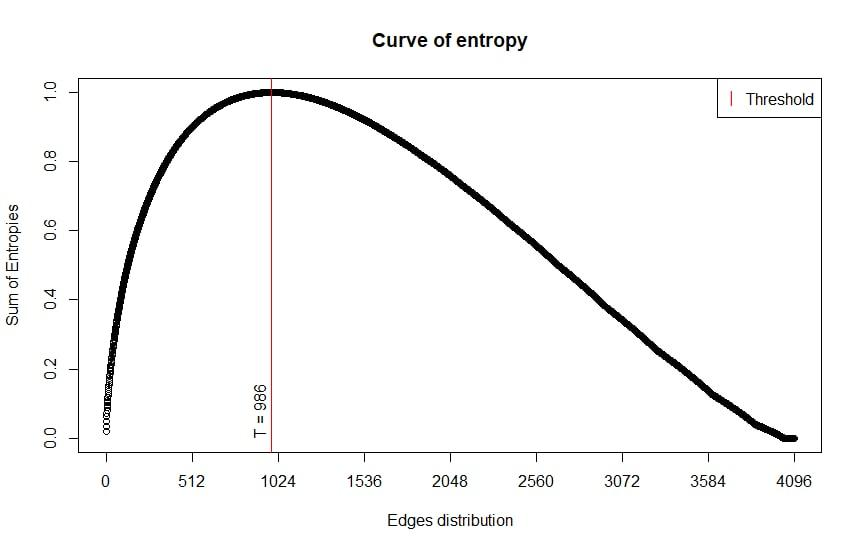

# BASiNETEntropy
* [Murilo Breve](https://github.com/murilobreve)
* [Matheus Pimenta](https://github.com/omatheuspimenta)
* [Fabrício Lopes](https://github.com/fabriciomlopes)

## Introduction
<div style="text-align: justify">
The BASiNET package aims to classify messenger RNA and long non-coding RNA, optionally also a third class such as small non-coding RNA may be included. The classification is made from measurements drawn from complex networks, for each RNA sequence a complex network is created. The networks are formed of vertices and edges, the vertices will be formed by words that can have their size defined by the parameter 'word'. Instead of using the threshold approach, this version of BASiNET uses the maximum entropy approach to remove the thresholds. The training step is necessary to obtain the entropy curves and then the edge list to be cut. Finally, all measurements taken from the networks are used for classification using the algorithm Random Forest. There are two data present in the 'BASiNETEntropy' package, "mRNA.fasta" and "ncRNA" with 10 sequences both. These sequences were taken from the data set used in the article (LI, Aimin; ZHANG, Junying; ZHOU, Zhongyin, Plek: a tool for predicting long non-coding messages and based on an improved k-mer scheme BMC bioinformatics, BioMed Central, 2014). These sequences are used to run examples.
</div>

---

## Instalation
<div style="text-align: justify">
To install BASiNETEntropy correctly it is necessary to install dependencies: igraph, randomForest, and Biostrings. The Biostrings package is in the BioConductor repository, the other packages are available in CRAN. The following commands must be executed in the R for the deployments to be installed.

```{r}
install.packages("igraph")  
install.packages("randomForest")  
if (!requireNamespace("BiocManager", quietly = TRUE))  
    install.packages("BiocManager")  

BiocManager::install("Biostrings")  
```
</div>

----

## Classification
<div style="text-align: justify">
The function "classify" applies an RNA classification methodology, at the end of the execution of the function is exposed the result for classification algorithm Random Forest.
</div>
Parameters:  
<div style="text-align: justify">

**mRNA** - Directory of an FASTA file containing mRNA sequences.  
**lncRNA** - Directory of an FASTA file containing lncRNA sequences.  
**sncRNA** - Directory of an FASTA file containing lncRNA sequences, this parameter is optional.  
**trainingResult** - The result of the training, (three or two matrices)  
**save_dataframe** -  Boolean. This parameter saves a .csv file with the features in the current directory. No file is created by default.  
**save_model** -  Boolean. This parameter saves a .rds file with the model in the current directory. No file is created by default.

</div>
<div style="text-align: justify">
Within the BASiNET package there are two sample files, one for mRNA sequence and one for ncRNA sequences. For the example below you will use these two files.
</div>

Defining parameters:
```{r}
mRNA <- system.file("extdata", "mRNA.fasta", package = "BASiNETEntropy")
lncRNA <- system.file("extdata", "ncRNA.fasta", package = "BASiNETEntropy")
library(BASiNETEntropy)
result <- classify(mRNA=mRNA, lncRNA=lncRNA)
```

<div style="text-align: justify">
After the completion of the function the results for J48 and Random Forest will be shown. For example data the results are J48 = 95.2381% hit, Random Forest = 4.76% error.

To obtain the entropy sum curve:
```
n_mRNA <- 4; n_lncRNA <- 5; n_treshold <- 2
entropymeasures<-trainingresult[[4]][4]
entropythreshold<-trainingresult[[4]][2]
BASiNETEntropy::curveofentropy(entropymeasures,entropythreshold)
```

The entropy sum curve refers to the mRNA class, the threshold at point 986 is found. Therefore, the edges referring to points 1 to 986 will be selected, and the rest will be discarded.

</div>

Example of generated entropy curves:


## Citation
If you use this software in your work, please cite our paper. (soon)

